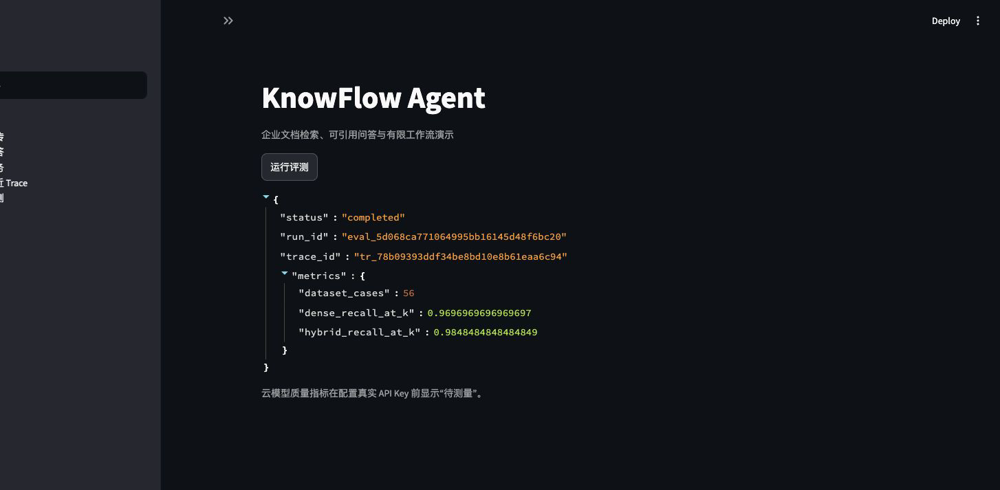

# KnowFlow Agent

[](https://github.com/LJLW1/knowflow-agent/actions/workflows/ci.yml)
[](https://github.com/LJLW1/knowflow-agent/actions/workflows/docker.yml)

基于 Hermes Agent 的企业文档知识库与有限工作流智能体。系统把团队内部需求、架构、API、运维、安全和事故资料解析为项目隔离的索引，提供混合检索、可追溯引用问答、只读 GitHub MCP 和定时知识库日报。

> 这是 LI Jiale 的非官方独立衍生项目，不属于 Nous Research。Hermes Agent 固定为 `0.18.2` / commit `9de9c25f620ff7f1ce0fd5457d596052d5159596`，本仓库不复制或修改其核心源码。

## 为什么选择 Hermes Agent

Hermes 已提供稳定的 Agent Loop、Tool Registry、Memory、Cron、MCP 客户端和 `delegate_task`。KnowFlow 将开发投入放在企业文档场景缺少的可引用 RAG、项目隔离、专项评测和工程交付，而不是重写已有循环。

## 核心功能

- `[自研]` PDF、DOCX、Markdown、TXT 解析、清洗、标题/页码保留、增量索引和崩溃恢复；
- `[自研]` BGE + Chroma 稠密检索、BM25 与 RRF 混合检索；
- `[自研]` 引用 allow-list、无答案拒答、Prompt 版本与注入防护；
- `[自研]` FastAPI、SQLite/Alembic、JSON 日志、trace ID、Streamlit；
- `[集成]` Hermes 插件 `knowledge_search`、`knowledge_answer`；
- `[集成]` 只读 GitHub MCP 的工具、仓库双白名单；
- `[Hermes 复用]` Agent Loop、工具调度、Memory、Cron 和 `delegate_task`；
- `[自研]` 56 条评测集、Hash CI 基线和可复现 BGE 手动评测。

完整架构见 [docs/architecture.md](docs/architecture.md)。

## 演示截图



截图来自实际运行的 Streamlit 页面：56 条评测数据已加载，HashEmbedding Dense/Hybrid Recall@6 已计算；云模型质量指标在配置真实 API Key 前明确显示“待测量”。

## 技术栈

Python 3.11、FastAPI、SQLAlchemy 2.0、Alembic、SQLite、Chroma、BAAI/bge-small-zh-v1.5、BM25、Streamlit、pytest、Docker Compose、GitHub Actions、Hermes Agent 0.18.2、MCP。

## 快速启动

```bash
cp .env.example .env
uv sync --extra dev --extra embedding
uv run python scripts/build_demo_documents.py
uv run knowflow-api
```

另一个终端：

```bash
uv run streamlit run app/streamlit_app.py
```

或使用 Docker Desktop：

```bash
docker compose up --build
```

API 为 `http://localhost:8000/docs`，演示页为 `http://localhost:8501`。云问答需要在本机 `.env` 设置 OpenAI 兼容的 base URL、API Key 和 model；不要提交 `.env`。

## Hermes 与 GitHub MCP

设置 `HERMES_ENABLE_PROJECT_PLUGINS=1` 后，Hermes 会发现 `.hermes/plugins/knowflow`。插件调用未公开到 OpenAPI 的检索端点时，必须携带本机生成的 `KNOWFLOW_INTERNAL_API_TOKEN`；未配置时端点拒绝服务。`.hermes/config.yaml` 使用 `${GITHUB_MCP_PAT}` 运行时替换、`X-MCP-Readonly: true` 和精确读取工具集。PAT 和内部令牌仅写入本机 `.env`。

```bash
uv sync --extra hermes
uv run hermes
```

## 评测

```bash
uv run pytest
uv run knowflow-eval --embedding hash --output reports/evaluation/hash-ci.json
uv run knowflow-eval --embedding bge --output reports/evaluation/bge-local.json
```

评测集共 56 条：15 条直接回答、8 条跨文档、8 条不存在答案、5 条幻觉诱导、8 条工具调用、6 条多步任务、6 条工具失败。HashEmbedding 只用于 CI；云模型指标在真实 Key 配置前统一标记“待测量”。

当前实测报告见 [reports/evaluation/hash-ci.md](reports/evaluation/hash-ci.md)。GitHub Actions 已完成 pytest、Ruff、strict mypy、Docker build、容器健康检查和命名卷重启持久化检查；BGE 下载与本机 Docker Desktop 状态见 [docs/known-issues.md](docs/known-issues.md)。

## 项目结构

```text
src/knowflow/          领域、文档、检索、RAG、API、集成和评测
.hermes/               项目插件、只读 MCP 与流程配置
demo_corpus/           可公开的自建团队文档
evaluation/            56 条评测集
tests/                 单元、集成、安全和 API 测试
docs/                  架构、API、演示和边界说明
reports/evaluation/    实际运行结果
```

## 个人贡献与上游边界

个人开发：领域契约、项目隔离数据模型、四类文档流水线、增量索引、混合检索、引用约束 RAG、FastAPI/Streamlit、Hermes 薄插件、MCP 防御策略、有限流程、日志、测试、评测、Docker 与 CI。

上游复用：Hermes Agent Loop、Provider 调用、Tool Registry、原生 Memory、FTS5 Session Search、MCP 客户端、Cron、`delegate_task`、Gateway、Plugin 框架和安全审批。这些能力不会写成个人独立成果。

更详细的声明见 [docs/contributions.md](docs/contributions.md)、[UPSTREAM.md](UPSTREAM.md) 和 [THIRD_PARTY_NOTICES.md](THIRD_PARTY_NOTICES.md)。

## 许可证

KnowFlow Agent 使用 MIT License。Hermes Agent 同样使用 MIT License；使用或分发上游代码时必须保留 Nous Research 的版权和许可证文本。
