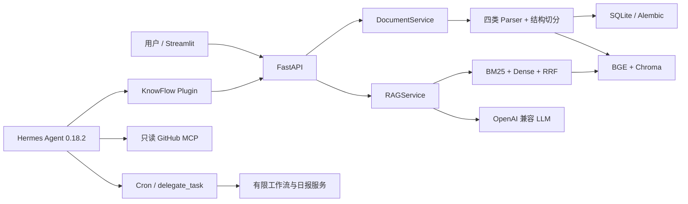

# 系统架构

## 请求数据流

1. API 中间件创建或透传 trace ID。
2. 上传接口校验文件名，Parser 提取页码和标题层级，清洗后按结构切分。
3. 先持久化 `indexing` 标记，再更新 Chroma 并原子提交 SQLite 文档、Chunk 和索引版本。
4. 查询服务并行使用 BM25 和稠密检索，通过 RRF 合并 Top-K。
5. Prompt 把文档标记为不可信数据；模型只能返回本轮 evidence 中的 Chunk ID。
6. RAGService 再次执行引用 allow-list 校验后返回答案、引用、延迟和 trace ID。
7. 若进程在 Chroma 更新和 SQLite 提交之间退出，启动恢复按旧 Chunk 重建向量；遗留 `pending/running` TaskRun 标记为 `interrupted`。

## 边界

Hermes Agent Loop、Tool Registry、Memory、Cron、MCP 客户端和 `delegate_task` 均为上游能力。KnowFlow 自研范围是文档流水线、项目隔离数据层、混合检索、可引用 RAG、业务工具、只读策略、有限流程和评测。
