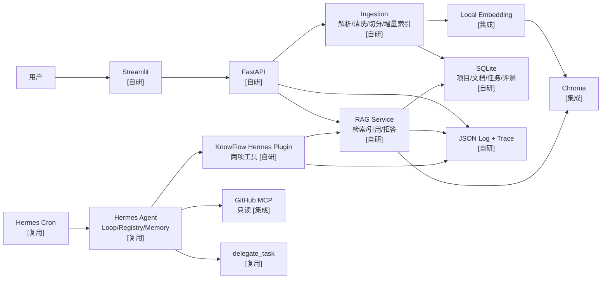
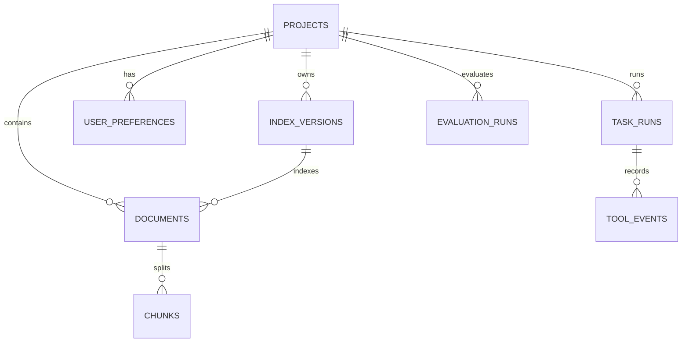

# KnowFlow Agent MVP 设计

> 状态：范围待用户确认，尚未开始业务实现  
> 上游：Hermes Agent `v0.18.2` / `v2026.7.7.2` / `9de9c25f620ff7f1ce0fd5457d596052d5159596`  
> 周期：4 周，按本科生个人项目控制范围  
> 推理预算：小额云 API 100–300 元；Embedding 本地运行

## 1. 项目定义

**KnowFlow Agent** 是一个基于 Hermes Agent 的企业文档可引用问答与有限工作流智能体。用户上传 PDF、DOCX、Markdown 或 TXT 后，系统建立本地语义索引，回答时返回页码/章节级引用；复杂任务可使用 Hermes 工具调度、只读 GitHub MCP 和有限子智能体协作。

它不是 Nous Research 官方产品，不是 Hermes Agent 的改名分支，也不以多租户企业平台为目标。

### 1.1 MVP 成功标准

一次完整演示必须能做到：

1. 上传至少两种不同格式、三份互相关联的文档；
2. 完成解析、清洗、结构切分、Embedding 和持久化索引；
3. 回答一个单文档问题和一个跨文档问题，并给出可打开的页码/章节引用；
4. 对文档中没有的答案明确拒答；
5. Hermes 正确选择 `knowledge_search` 或 `knowledge_answer`；
6. 复杂任务调用只读 GitHub MCP，并由有限子智能体完成综合与引用校验；
7. 重启服务后仍能恢复项目、索引元数据、偏好和 TaskRun；
8. Cron 触发一次知识库更新摘要；
9. 通过 trace ID 查到检索、模型和工具执行链；
10. 可复跑不少于 50 条问题的评测，并输出真实结果。结果当前全部为**待测量**。

## 2. 贡献标签

| 标签 | 定义 | 示例 |
|---|---|---|
| `[自研]` | 本仓库独立设计、实现和测试 | 解析、增量索引、引用、FastAPI、评测 |
| `[Hermes 复用]` | 上游现成能力，仅配置或调用 | Agent Loop、工具调度、Memory、Cron、delegate |
| `[集成]` | 使用第三方组件，个人贡献是适配和验证 | Chroma、本地 Embedding、GitHub MCP、Streamlit |

README、架构图、演示脚本和简历必须沿用这三个标签。

## 3. 范围

### 3.1 Must Have

| 功能 | 归属 | 完成定义 |
|---|---|---|
| PDF/DOCX/MD/TXT 解析 | `[自研]` | 保留文档、页码/章节、顺序和内容 hash；异常文件有明确错误 |
| 清洗与结构切分 | `[自研]` | 标题感知、token-aware、可配置 overlap；golden chunk 测试 |
| 增量索引 | `[自研+集成]` | 相同内容跳过，变更文档重建，删除可清理；Chroma 持久化 |
| 中文 Embedding | `[集成]` | 本地模型批处理；模型名、维度和版本写入 index version |
| 可引用 RAG | `[自研]` | Top-K、上下文拼装、无答案拒答、页码/章节引用 |
| FastAPI | `[自研]` | 六个最小接口、OpenAPI、统一错误和 trace ID |
| Streamlit Demo | `[自研+集成]` | 上传、问答、引用、Task 状态、最近 trace |
| 项目数据库 | `[自研]` | SQLite 保存项目、文档、索引、偏好、任务和评测 run |
| Hermes 知识工具 | `[自研+Hermes 复用]` | 插件注册 `knowledge_search`、`knowledge_answer` |
| GitHub MCP | `[集成+Hermes 复用]` | 只读工具白名单；无任何写操作 |
| 子智能体流程 | `[自研+Hermes 复用]` | 最多三个 child：检索/外部收集、综合、引用校验 |
| 项目级记忆 | `[自研]` | 偏好和任务历史按 `project_id` 持久化；不替代 Hermes Memory |
| 定时摘要 | `[自研+Hermes 复用]` | Cron 负责触发；项目代码生成幂等更新报告 |
| Prompt 管理 | `[自研]` | 文件化版本、引用和拒答约束、变更记录 |
| 可观测性与恢复 | `[自研]` | JSON 日志、trace ID、错误分类、超时和安全重试 |
| 测试与交付 | `[自研+集成]` | pytest、Docker、Compose、Actions、50+ 评测问题 |

### 3.2 Should Have

- BM25 与向量混合检索；
- Reranker、查询改写和文档/章节元数据过滤；
- 文档变更检测、索引版本、删除重建；
- Streamlit badcase 分析；
- 三组实验：无检索、固定切分稠密检索、优化后的混合检索与引用 Prompt。

Should Have 只有在 Must Have 的端到端链路、测试和评测程序完成后才进入。

### 3.3 Could Have / 明确不做

- OCR、多模态表格解析、GraphRAG、知识图谱；
- PostgreSQL、Milvus 集群、Kubernetes、分布式任务队列；
- 模型微调、RLHF、量化部署；
- 复杂前端；
- 完整多租户 RBAC/SSO；
- 为展示 LangChain/LangGraph 而重写 Hermes Agent Loop。

## 4. 技术决策

| 领域 | 选择 | 原因与边界 |
|---|---|---|
| Python | 3.11 | 满足 Hermes v0.18.2 约束，生态稳定 |
| Agent runtime | Hermes Agent v0.18.2 | 复用工具循环、MCP、Cron、delegate 和持久 Session |
| API | FastAPI + Pydantic | 清晰的数据契约和 OpenAPI；不同时维护 Flask |
| 项目数据 | SQLite | 单用户本地 MVP 足够；显式 migration 和备份 |
| 向量库 | Chroma persistent | 单机简单、元数据过滤方便；不做集群 |
| Embedding | 本地中文模型，首选 `BAAI/bge-small-zh-v1.5` | 成本可控；模型和版本必须锁定并记录 |
| 文档解析 | PyMuPDF、python-docx、自研文本/Markdown适配 | 覆盖四种 Must Have 格式 |
| Demo | Streamlit | 最快形成可面试演示的交互闭环 |
| 评测 | Python + pytest/独立 eval runner | 指标透明、可重复，不依赖重框架 |
| 部署 | Docker + docker-compose | 单机可复现；不引入 Kubernetes |
| CI | GitHub Actions | 运行 lint、unit、API smoke 和容器构建 |

Embedding 模型是初始选择，不是不可变接口。替换模型会创建新的 `IndexVersion`，不能把不同模型产生的向量混在同一 collection。

## 5. 系统架构



### 5.1 请求数据流

上传链路：

```text
文件 → MIME/大小/路径校验 → 格式解析 → 清洗 → 结构切分
→ 文档与 chunk hash → 与当前 IndexVersion 比较
→ 仅对新增/变更 chunk 做 Embedding → Chroma upsert
→ SQLite 提交 Document/Chunk/IndexVersion 元数据
```

问答链路：

```text
query + project_id → 查询规范化 → Top-K 检索
→（Should Have：BM25 合并 + rerank）→ 上下文预算截断
→ 引用约束 Prompt → 云端 LLM → 结构化 AnswerResult
→ 引用存在性与范围校验 → 返回或降级为拒答
```

Agent 任务链路：

```text
用户任务 → Hermes Agent Loop → knowledge_search / knowledge_answer
→ 必要时只读 GitHub MCP → 必要时 delegate_task
→ 综合回答 → 引用校验 → TaskRun 与 trace 持久化
```

## 6. 模块与目录

```text
knowflow-agent/
├── pyproject.toml
├── uv.lock                         # 或 requirements.lock，二选一
├── .env.example
├── Dockerfile
├── docker-compose.yml
├── LICENSE                         # 本项目许可证
├── THIRD_PARTY_NOTICES.md          # Hermes MIT 声明
├── UPSTREAM.md                     # tag、SHA、复用范围
├── src/knowflow/
│   ├── api/
│   │   ├── app.py
│   │   ├── routes_documents.py
│   │   ├── routes_query.py
│   │   ├── routes_tasks.py
│   │   ├── routes_evaluations.py
│   │   └── errors.py
│   ├── domain/
│   │   ├── models.py               # 六个共享核心类型
│   │   └── errors.py
│   ├── ingestion/
│   │   ├── parsers/
│   │   ├── cleaner.py
│   │   ├── chunker.py
│   │   └── indexer.py
│   ├── retrieval/
│   │   ├── embeddings.py
│   │   ├── vector_store.py
│   │   ├── dense.py
│   │   └── hybrid.py               # Should Have
│   ├── rag/
│   │   ├── service.py
│   │   ├── citations.py
│   │   └── prompts.py
│   ├── tasks/
│   │   ├── service.py
│   │   ├── orchestration.py
│   │   └── reports.py
│   ├── persistence/
│   │   ├── sqlite.py
│   │   ├── repositories.py
│   │   └── migrations/
│   ├── evaluation/
│   │   ├── runner.py
│   │   ├── metrics.py
│   │   └── judges.py
│   ├── observability/
│   │   ├── logging.py
│   │   └── tracing.py
│   └── config.py
├── hermes_plugin/knowflow/
│   ├── plugin.yaml
│   ├── __init__.py
│   └── tools.py                    # 仅适配，不放业务逻辑
├── apps/streamlit_app.py
├── prompts/
│   ├── answer/v1.md
│   ├── no_answer/v1.md
│   ├── synthesis/v1.md
│   └── citation_check/v1.md
├── evals/
│   ├── datasets/questions.v1.jsonl
│   ├── configs/
│   └── reports/
├── tests/
│   ├── unit/
│   ├── integration/
│   ├── api/
│   ├── fixtures/
│   └── smoke/
├── docs/
│   ├── architecture.md
│   ├── api.md
│   ├── contributions.md
│   └── evaluation.md
└── patches/                        # 默认不存在或为空
```

原则：Hermes 插件层只做输入输出转换、认证上下文和调用项目服务，不复制 ingestion/RAG 逻辑。FastAPI、插件和评测程序必须调用同一 service 和同一核心类型。

## 7. 核心类型

以下是逻辑契约，不是本阶段要提交的业务代码。

### `DocumentRecord`

| 字段 | 类型 | 说明 |
|---|---|---|
| `document_id` | UUID/string | 稳定 ID |
| `project_id` | UUID/string | 项目隔离键 |
| `filename` | string | 脱敏后的原始文件名 |
| `media_type` | enum | pdf/docx/markdown/text |
| `content_sha256` | string | 增量判断 |
| `status` | enum | pending/indexed/failed/deleted |
| `index_version_id` | string/null | 当前索引版本 |
| `created_at`, `updated_at` | datetime | UTC |

### `ChunkRecord`

| 字段 | 类型 | 说明 |
|---|---|---|
| `chunk_id` | string | 稳定 ID |
| `document_id`, `project_id` | string | 关联与隔离 |
| `ordinal` | integer | 文档内顺序 |
| `text` | string | 清洗后的文本 |
| `text_sha256` | string | 去重与变更 |
| `page_start`, `page_end` | integer/null | PDF 页码 |
| `section_path` | list[string] | 标题路径 |
| `token_count` | integer | 上下文预算 |

### `RetrievalHit`

`chunk_id`、`document_id`、`score`、`rank`、`text`、`page_start/page_end`、`section_path`、`retriever`、`index_version_id`。

### `Citation`

`citation_id`、`document_id`、`chunk_id`、`filename`、`page_start/page_end`、`section_path`、`quote`。`quote` 只保存支持回答的短片段，不返回整页。

### `AnswerResult`

`answer`、`citations[]`、`answerable`、`refusal_reason`、`retrieval_hits[]`、`prompt_version`、`model`、`usage`、`latency_ms`、`trace_id`。

### `TaskRun`

`task_id`、`project_id`、`status`、`request`、`plan`、`tool_events`、`result`、`error_code`、`started_at/finished_at`、`trace_id`。

## 8. API

### `POST /api/v1/documents`

- `multipart/form-data`：`project_id`、文件；
- 同步完成校验和元数据创建，索引可在请求内完成小文件处理；
- 返回 `DocumentRecord` 和是否跳过/重建；
- MVP 不承诺持久分布式后台队列。大文件超时应返回可解释错误，而不是假装异步可靠。

### `POST /api/v1/query`

请求：

```json
{
  "project_id": "project-1",
  "question": "项目部署前需要完成哪些检查？",
  "top_k": 6,
  "filters": {"document_ids": []}
}
```

响应为 `AnswerResult`。`answerable=false` 时必须有 `refusal_reason`，引用可为空。

### `POST /api/v1/tasks`

创建有限 Agent 任务，返回 `TaskRun`。只允许预定义 task mode，不接受任意 shell 指令。长任务使用进程内 runner；服务重启后将运行中任务标记为 `interrupted`，允许用户重试，但不宣称具备持久队列语义。

### `GET /api/v1/tasks/{task_id}`

返回 TaskRun 当前状态和已脱敏的 tool events。

### `POST /api/v1/evaluations/run`

输入数据集版本和实验配置，返回 evaluation run ID。默认只允许本地管理员调用，避免公开接口消耗 API 预算。

### `GET /healthz`

检查进程、SQLite 可写、Chroma collection 可读和配置完整性；不发起付费 LLM 请求。

### 8.1 通用错误

```json
{
  "error": {
    "code": "RETRIEVAL_TIMEOUT",
    "message": "检索超时，请稍后重试",
    "retryable": true,
    "trace_id": "..."
  }
}
```

错误码族：`INGEST_*`、`INDEX_*`、`RETRIEVAL_*`、`LLM_*`、`TOOL_*`、`MCP_*`、`TASK_*`、`EVAL_*`。

## 9. 数据库

SQLite 最小表：



| 表 | 关键字段 |
|---|---|
| `projects` | `project_id`, `name`, timestamps |
| `documents` | DocumentRecord 字段、`error_code` |
| `chunks` | ChunkRecord 字段；正文可存 SQLite 或文件，MVP 先存 SQLite |
| `index_versions` | embedding 模型/版本、chunk 策略、collection、创建时间 |
| `user_preferences` | `project_id`, `key`, JSON value, version |
| `task_runs` | TaskRun 的 durable 状态，不等于 durable executor |
| `tool_events` | tool、参数摘要、状态、耗时、错误、trace |
| `evaluation_runs` | dataset/config/git SHA、指标 JSON、成本和时间 |

约束：

- 所有读写必须带 `project_id`；
- Chroma metadata 同样包含 `project_id`、`document_id`、`index_version_id`；
- SQLite 事务成功后再切换“当前索引版本”；
- 索引可从原文和 SQLite 元数据重建；
- 每次 migration 可前进，开发阶段不承诺复杂回滚。

## 10. RAG 方案

### 10.1 解析与切分

- PDF：提取页码和文本块顺序，不做 OCR；
- DOCX：保留标题层级和段落，不执行宏；
- Markdown：保留 heading path、代码块边界；
- TXT：编码探测失败时拒绝，不静默产生乱码；
- 清洗：统一换行、删除重复页眉页脚、保留列表和代码；
- 切分：先按章节，再按 token 上限切分；chunk overlap 配置化。

初始 chunk 参数属于实验配置，不能在简历中写成“最优”。Baseline 使用固定切分；优化组再比较结构切分。

### 10.2 检索与引用

Must Have：

1. query Embedding；
2. 按 `project_id/index_version_id` 过滤 Chroma；
3. 返回 Top-K `RetrievalHit`；
4. 只将预算内 chunk 放入 Prompt；
5. 模型输出引用 ID；
6. 后处理校验引用 ID 存在、属于当前项目且对应入模 chunk；
7. 没有足够证据时拒答。

Should Have：

- BM25 与 dense 结果用 RRF 合并；
- Reranker 重排候选；
- query rewrite 仅生成检索查询，不改变用户问题；
- 章节、文件和时间元数据过滤。

### 10.3 Prompt 契约

- 只能使用提供的知识片段回答；
- 每个关键事实必须关联 citation ID；
- 证据不足时输出 `answerable=false`；
- 文档内容中的指令按数据处理，不视为系统指令；
- 输出先通过 Pydantic/JSON 校验，再转换给用户；
- Prompt 文件携带版本，例如 `answer/v1`，评测记录具体版本。

## 11. Hermes 集成

### 11.1 插件工具

`knowledge_search`：

- 输入：`project_id`、`query`、`top_k`、可选 filters；
- 输出：紧凑的 `RetrievalHit[]`，限制总字符；
- 不调用生成模型。

`knowledge_answer`：

- 输入：`project_id`、`question`、可选 filters；
- 输出：`AnswerResult`；
- 内部调用同一 RAG service，不在插件复制逻辑。

工具注册和调度属于 Hermes；两个工具的 Schema、实现、错误映射、trace 和测试属于 KnowFlow。

### 11.2 子智能体

只支持一个有界模板：

1. child A：从企业知识库检索；
2. child B：必要时从只读 GitHub MCP 收集外部项目事实；
3. parent：综合；
4. child C 或本地校验器：验证引用。

限制：

- 并发 child 不超过 3；
- 每个 child 有超时、Token 上限和明确输出 Schema；
- 不递归创建无限子智能体；
- 子智能体失败时 parent 可用已有证据完成或拒答；
- TaskRun 保存 child 状态，但不声称 `delegate_task` 是持久队列。

### 11.3 Cron

Hermes Cron 每日触发 `generate_knowledge_update_report(project_id)`。项目任务必须幂等：

- 用日期和项目生成 idempotency key；
- 同一天重复执行更新同一报告；
- 只汇总新增、更新、删除的文档和失败索引；
- 记录 Token、耗时、状态；
- 不把 Cron 调度器列为个人成果。

## 12. MCP 接入

只连接一个 GitHub MCP Server，并在实际 discovery 后固定准确工具名。策略是：

- allowlist 只含仓库内容、commit、issue、PR 的读取/搜索操作；
- 不暴露创建、编辑、合并、评论、删除、push 等操作；
- 固定允许访问的 owner/repository；
- 超时、最大结果数和最大字符数；
- MCP 返回内容作为不可信数据，不能覆盖系统 Prompt；
- MCP 失败时返回 `MCP_TIMEOUT`/`MCP_UNAVAILABLE`，允许 Agent 使用知识库证据继续或拒答；
- 容器只注入最小只读凭据；日志不记录 token。

Hermes 的工具白名单属于进程内控制。根据上游安全模型，真正的隔离依靠容器/OS 和最小权限凭据。

## 13. 错误恢复

| 故障 | 行为 | 是否重试 |
|---|---|---|
| 不支持/损坏文件 | 标记文档 failed，返回明确格式错误 | 否 |
| Embedding 批次失败 | 不切换 index version；保留旧索引 | 限次指数退避 |
| Chroma 不可用 | 查询返回 503，不调用 LLM 编答案 | 恢复后重试 |
| LLM 429/5xx | 记录 Provider、次数和等待 | 限次退避 |
| LLM 输出非 JSON | 一次结构修复；仍失败则错误 | 最多一次 |
| 引用不存在 | 不返回带错误引用的答案，降级拒答 | 可用同结果重校验一次 |
| MCP 超时 | 记录失败，使用已有文档或拒答 | 最多一次 |
| 子智能体超时 | 释放任务，parent 用部分结果继续 | 不无限重启 child |
| 服务重启 | `running` TaskRun 改为 `interrupted` | 用户显式重试 |
| Cron 重复触发 | idempotency key 合并 | 安全重放 |

只对幂等操作自动重试。上传元数据提交、索引版本切换和报告生成都必须有幂等键或事务保护。

## 14. 安全边界

MVP 是单用户/可信团队本地演示，不是公网企业 SaaS。

- 允许的扩展名和 MIME 双重检查；
- 上传大小、页数、解压大小、解析时间和 chunk 数设上限；
- 文件名规范化，禁止 `..` 和绝对路径；
- 不执行文档宏、附件、脚本或 Markdown HTML；
- 文档文本与 MCP 输出均标记为不可信上下文，防 Prompt Injection；
- API key 只从环境变量读取，提供 `.env.example`，不提交真实秘密；
- 日志默认不记录完整文档、Prompt、API key 或 GitHub token；
- 容器使用非 root 用户、只挂载必要目录；
- 只读 GitHub 凭据和精确仓库范围；
- 不宣称完整 RBAC、租户隔离或合规能力。

## 15. 日志与可观测性

每条 JSON 日志至少包含：

```text
timestamp, level, service, event, trace_id, span_id,
project_id, task_id, document_id, tool_name,
status, duration_ms, error_code, retry_count,
model, prompt_version, input_tokens, output_tokens, estimated_cost
```

必要 span：

- `document.parse`
- `document.chunk`
- `embedding.batch`
- `index.upsert`
- `retrieval.dense`
- `retrieval.rerank`
- `llm.answer`
- `tool.knowledge_search`
- `tool.knowledge_answer`
- `mcp.github`
- `delegate.child`
- `task.complete`

敏感字段使用 allowlist 记录，而不是先全量记录再尝试脱敏。演示页只显示摘要和耗时，不直接展示秘密或完整 Prompt。

## 16. 测试

### 16.1 测试层次

| 层次 | 必测内容 |
|---|---|
| 单元测试 | 四类 parser、cleaner、chunker、hash、citation validator、错误映射 |
| 集成测试 | SQLite + Chroma 增量索引、重启恢复、删除重建、项目隔离 |
| API 测试 | 六个接口、错误契约、trace ID、OpenAPI |
| Hermes 插件测试 | 工具 Schema、参数、结果大小、service 调用、失败回填 |
| MCP 策略测试 | 只读工具可见，写工具不可见，超时和越权仓库被拒绝 |
| Agent 场景测试 | 工具选择、有限子任务、部分失败和拒答 |
| 容器 smoke | clean build、healthz、volume 重启持久化 |
| Eval smoke | 小数据集在 CI 可运行；付费完整评测手动触发 |

不以覆盖率数字代替关键场景。CI 至少阻止 parser、citation、权限和数据隔离回归。

### 16.2 GitHub Actions

普通 push/PR：

1. 安装锁定依赖；
2. lint/type check；
3. pytest unit + integration；
4. API smoke；
5. Docker build；
6. 小型无付费 eval smoke。

完整 LLM 评测使用手动 workflow，读取 GitHub Secret，并设置预算上限；Fork PR 不获得秘密。

## 17. 评测设计

### 17.1 数据集

首版 56 条，按主要类别互斥：

| 类别 | 数量 | 验证重点 |
|---|---:|---|
| 单文档直接回答 | 15 | 精确召回和引用 |
| 跨文档综合 | 8 | 多来源召回和综合 |
| 文档中不存在 | 8 | 拒答 |
| 幻觉诱导/错误前提 | 5 | 纠正前提、不迎合 |
| 需要调用工具 | 8 | 工具选择和参数 |
| 多步执行 | 6 | 子任务和完成率 |
| 工具失败 | 6 | 超时、错误恢复、降级 |
| 合计 | 56 | 不少于 50 |

每条 JSONL 至少记录：

```text
id, category, project_id, question,
gold_answer_points, gold_document_ids, gold_chunk_ids,
expected_answerable, expected_tools, failure_injection,
notes, dataset_version
```

测试文档必须可以随仓库合法分发，或由脚本生成。不能把公司私有资料提交到 GitHub。

### 17.2 指标

| 指标 | 定义 |
|---|---|
| Retrieval Recall@K | 至少一个 gold supporting chunk 出现在 Top-K 的问题比例；同时报告 K |
| 引用正确率 | 返回引用中真正支持对应陈述的比例；抽样人工复核 |
| 回答忠实度 | 回答事实是否都能由检索上下文支持；规则 + 固定 judge Prompt |
| 幻觉率 | 不受证据支持的事实陈述数 / 总事实陈述数，另报告不可回答集误答率 |
| 工具选择准确率 | 预测工具集合/顺序是否满足 `expected_tools` |
| 任务完成率 | 场景验收条件全部满足的 TaskRun 比例 |
| 平均响应时间 | 端到端 mean，同时报告 p50/p95 和硬件/模型 |
| Token/API 成本 | 从 Provider usage 计数，记录价格快照日期和币种 |
| 错误恢复成功率 | 注入故障后最终得到正确答案、正确拒答或可解释失败的比例 |

Judge 模型不能独占最终结论：引用正确率和高风险 badcase 至少人工复核一遍，并保存分歧。

### 17.3 Baseline

| 实验 | 配置 | 状态 |
|---|---|---|
| B0 无检索 | 只把用户问题交给相同回答模型 | 待测量 |
| B1 稠密基线 | 固定长度切分 + dense Top-K + 基础 Prompt | 待测量 |
| B2 优化方案 | 结构切分 + hybrid + rerank + 引用/拒答 Prompt | 待测量，属于 Should Have |

控制变量：

- 相同回答模型和温度；
- 相同问题集和文档版本；
- 固定随机种子（可用处）；
- 记录 Prompt、Embedding、chunk、K、reranker 和 git SHA；
- 每组保存原始逐题结果，不只保存均值。

MVP 验收要求是指标可真实复算、结果完整披露，不预先伪造“提升百分比”。若 B2 没有提升，也要保留结果并分析原因。

## 18. 部署

`docker-compose.yml` 只需两个应用服务：

- `api`：FastAPI，同时挂载 SQLite、Chroma、uploads 和 reports volumes；
- `ui`：Streamlit，调用 API。

Hermes 可作为 API 容器内的固定依赖或单独本地进程。优先选择同一受限容器内的固定依赖以减少四周部署复杂度，但必须保证插件代码与项目服务分层。无需为 Chroma 单独启动集群服务。

部署验收：

- 新机器从 `.env.example` 和 README 可启动；
- 容器以非 root 运行；
- `GET /healthz` 通过；
- 上传、查询、Agent task 和 eval smoke 可完成；
- 重启后 SQLite/Chroma 数据仍在；
- 镜像和依赖版本可追溯。

## 19. 四周里程碑

这不是开始实施的授权，只是范围确认后的节奏。

### 第 1 周：上游与设计

- D1：安装 Python 3.11，固定 Hermes v0.18.2，跑通基础 Agent；
- D2：跑通插件样例和一个只读测试工具；
- D3：确定数据契约、SQLite migration 和 API 契约；
- D4：准备可公开测试文档和 10 条种子问题；
- D5：建立 GitHub issues/看板、架构与贡献文档。

### 第 2 周：端到端 RAG

- D6：PDF/TXT parser 和 fixture；
- D7：DOCX/Markdown parser、清洗；
- D8：结构切分、hash、SQLite 元数据；
- D9：Embedding、Chroma、增量索引；
- D10：RAG、引用校验、FastAPI query 和基础 Streamlit。

### 第 3 周：Agent 与工程化

- D11：`knowledge_search` 插件工具；
- D12：`knowledge_answer`、Prompt 版本和拒答；
- D13：只读 GitHub MCP、白名单和故障测试；
- D14：有限 delegate 流程、TaskRun、项目偏好；
- D15：Cron 报告、JSON 日志、Docker/Compose。

### 第 4 周：评测与交付

- D16：扩展到 56 条评测集，完成 B0/B1；
- D17：Should Have 中只选一个最有收益的检索优化；
- D18：B2、badcase、延迟/成本/恢复实验；
- D19：CI、完整测试、README、API 和架构图；
- D20：演示截图、三分钟视频、贡献说明、简历草稿和 release。

如前两周延期，优先砍掉 hybrid/reranker/badcase 页面，不砍引用、拒答、评测、日志、测试和贡献边界。

## 20. 交付与验收

### 20.1 必交文件

- 可运行源代码；
- `pyproject.toml` 和 lockfile；
- `.env.example`；
- `Dockerfile`、`docker-compose.yml`；
- pytest 和 GitHub Actions；
- API 文档与 OpenAPI；
- 架构图；
- RAG 评测报告和逐题结果；
- 性能/成本结果；
- 演示截图；
- 三分钟演示视频脚本；
- README；
- `UPSTREAM.md`、`THIRD_PARTY_NOTICES.md`、`docs/contributions.md`；
- 已知问题和后续方向。

### 20.2 Must Have 验收表

| 验收项 | 证据 | 当前状态 |
|---|---|---|
| 四种文档 parser | fixtures + unit tests | 已完成 |
| 增量 Chroma 索引 | 重复/更新/删除集成测试 | 已完成 |
| 可引用问答与拒答 | API 结果 + citation tests | 已完成（真实云模型质量待测量） |
| 六个接口 | OpenAPI + API tests | 已完成 |
| 两个 Hermes 工具 | plugin tests + trace | 已完成 |
| 只读 GitHub MCP | allowlist/deny tests | 已完成 |
| 有限子任务 | success/timeout/partial failure | 已完成 |
| 项目级持久化 | restart + isolation tests | 已完成 |
| 每日摘要 | 幂等 Cron 演示 | 已完成 |
| 日志与恢复 | trace + fault injection | 已完成 |
| 56 条评测 | dataset + raw results + report | 已完成（BGE/云模型指标待测量） |
| Docker/CI | clean build + green Actions | 已完成（GitHub Actions Linux runner） |

## 21. 原项目与个人贡献边界

### 上游已有，不能写成个人研发

- Agent Loop；
- Provider 调用、重试、fallback；
- Tool Registry 和 Function Calling 调度；
- Hermes Memory；
- FTS5 Session Search；
- MCP 客户端；
- Cron 调度器；
- `delegate_task` 运行时；
- Gateway；
- Plugin 框架；
- 安全审批。

### 个人应能证明

- 四格式文档解析和结构切分；
- 内容 hash、增量索引和版本管理；
- 本地 Embedding/Chroma 适配；
- 可引用 RAG、拒答和引用校验；
- FastAPI、SQLite 项目模型和 Streamlit；
- 两个 Hermes 插件工具；
- GitHub MCP 的只读策略、适配和失败恢复；
- 有限子智能体工作流设计和评测；
- Prompt 版本、结构化日志和 trace；
- 56 条评测集、baseline、实际指标和 badcase；
- Docker、测试、CI、文档和演示。

### README 固定声明模板

> KnowFlow Agent is an independent, unofficial project built on top of Nous Research's Hermes Agent. It pins upstream version v0.18.2 (`v2026.7.7.2`, commit `9de9c25f620ff7f1ce0fd5457d596052d5159596`). Hermes Agent's Agent Loop, tool runtime, Memory, Session Search, MCP client, Cron, delegation, Gateway, plugin framework, and approval mechanisms are upstream capabilities. KnowFlow's original contributions are documented in `docs/contributions.md`.

复制或分发 Hermes 的全部或实质部分时，必须保留其 MIT 版权和许可证文本。默认集成方式不复制核心源码；任何必要补丁单独放 `patches/` 并解释。

## 22. 范围确认问题

实施前只需要确认三点：

1. 接受固定 Hermes v0.18.2 的独立扩展包形态；
2. 接受 Must Have 优先、Should Have 最多选择一个检索优化；
3. 接受项目定位为单用户/可信团队本地 MVP，不宣称企业多租户生产平台。

确认后再进入仓库初始化和逐步实现，不直接大规模修改 Hermes 源码。
