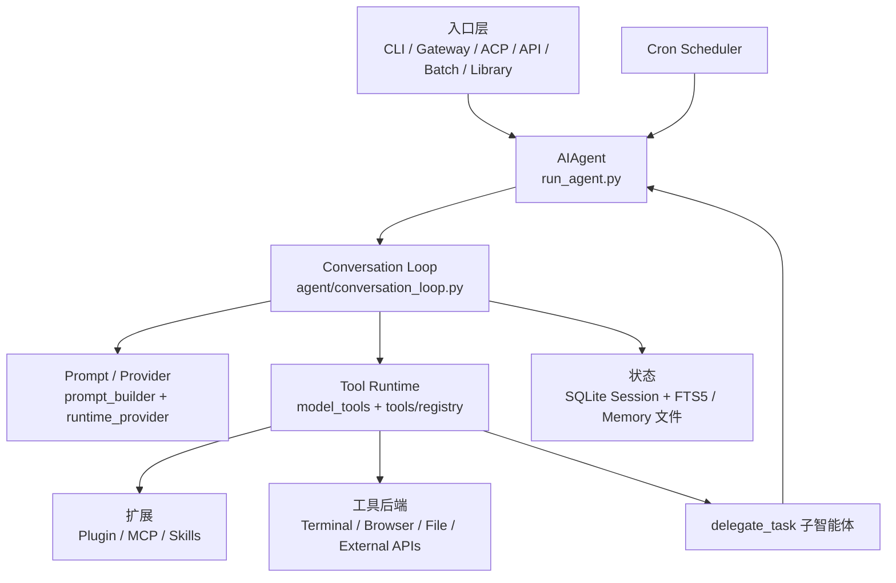
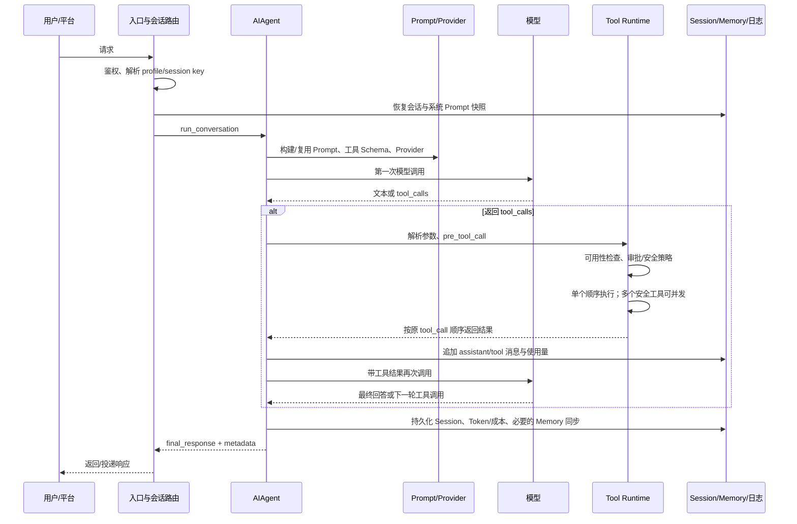

# AI Agent 实习岗位技能调研与 Hermes Agent 技术审计报告

> 调研截止：2026-07-25  
> 岗位窗口：2025-07-25 至 2026-07-25  
> Hermes 稳定基线：`v0.18.2` / tag `v2026.7.7.2` / commit `9de9c25f620ff7f1ce0fd5457d596052d5159596`  
> 原始数据：[data/job_postings.csv](../../data/job_postings.csv)

## 0. 结论先行

这 20 个应用型实习岗位给出的信号很集中：

- Python 和 Agent 均被 19/20 个岗位提及，提及率 95%；数据处理为 18/20（90%），大模型评测为 15/20（75%），RAG 为 14/20（70%）。
- Function Calling 和 Prompt Engineering 均为 10/20（50%）。数据库、可演示前端各为 9/20（45%）；Embedding、LangChain、日志与可观测性各为 7/20（35%）。
- FastAPI 只有 4/20、MCP 只有 2/20。低频不等于没有价值：FastAPI 是把项目变成可调用服务的基础证据，MCP 则适合作为能拉开项目差异的集成证据，但不能把它们说成“大多数岗位硬门槛”。
- 4 个算法对照岗位中，Python、PyTorch、微调均为 4/4，顶会论文为 3/4，强化学习和分布式推理各为 2/4。它们明显比应用组集中，不应成为一个月 MVP 的主要投入。
- Hermes 已提供 Agent Loop、工具注册和调度、Memory、FTS5 Session Search、MCP 客户端、Cron、`delegate_task`、Gateway、插件框架和安全审批。KnowFlow Agent 的可归因价值应放在企业文档解析、增量索引、可引用 RAG、项目级数据模型、评测闭环、可观测性与工程交付，而不是重写或改名上游已有能力。
- 推荐形态是独立扩展包：固定上游版本，通过 Hermes 插件注册 `knowledge_search`、`knowledge_answer`，不复制核心源码。这样既能复用成熟运行时，也最便于面试官核对个人贡献。

## 1. 第一阶段：AI Agent 实习岗位调研

### 1.1 样本与统计口径

核心组含 20 个中国地区应用型实习岗位；另有 4 个算法岗位作为对照，不进入核心技能占比。纳入标准是：

1. 页面日期位于固定窗口内；
2. 职责和要求足够完整；
3. 工作内容以 AI 应用、Agent、RAG 或 LLM 后端落地为主；
4. 已下线岗位只有在窗口内且 JD 完整时保留，并显式标记状态。

去重键依次为公司、岗位名称和 JD 内容。技能按岗位二值统计：同一岗位重复出现同一技能只计一次；“明确必需”来自 `required_skills`，“明确优先”来自 `preferred_skills`，“任一提及”是两者并集。分母固定为 20 个核心岗位。

需要特别注意：

- 20 个核心样本均来自实习僧，算法对照中 3 个来自实习僧、1 个来自牛客。该数据可以反映一批近期真实 JD，但不应被解释为整个中国招聘市场的无偏抽样。
- 核心岗位页面均只提供“刷新日期”，本报告没有把刷新日期写成发布时间。
- “招聘中/已下线”是 2026-07-25 的页面快照；招聘页面之后可能改变。
- 没有从宽泛描述推断具体技术。例如“后端开发”不会自动计作 FastAPI，“RAG”不会自动拆成 Embedding 或向量数据库。

### 1.2 核心岗位明细

完整职责、证据说明和标准化技能标签见 CSV。下表保留核查所需的主要字段。

| ID | 岗位 / 公司 / 城市 | 页面日期 | 状态 / 学历 | 明确必需 | 明确优先 |
|---|---|---|---|---|---|
| J01 | [大模型应用研发工程师实习生 · 百度](https://www.shixiseng.com/intern/inn_o7dhg2wwsans) / 上海 | 2026-07-23，刷新日期 | 招聘中 / 本科及以上 | Python、RAG、Agent、Prompt、数据、评测 | LangChain、Docker、Kubernetes、CI/CD |
| J02 | [AI Agent 算法实习生（企业智能） · 小红书](https://www.shixiseng.com/intern/inn_8s2zkxqufl9u) / 北京 | 2026-07-15，刷新日期 | 招聘中 / 本科及以上 | Python、Agent、RAG、Prompt、Function Calling、评测 | Embedding、重排序、Multi-Agent、数据库 |
| J03 | [AI 大模型开发实习生 · FOSHO](https://www.shixiseng.com/intern/inn_1wtj31m7famb) / 深圳 | 2026-07-22，刷新日期 | 招聘中 / 本科及以上 | Python、FastAPI、Flask、Agent、RAG、LangGraph、日志 | 前端、PyTorch、Docker |
| J04 | [AI Engineer Intern · 欧摩威中国](https://www.shixiseng.com/intern/inn_bk0jwfkyznmc) / 上海 | 2026-07-10，刷新日期 | 招聘中 / 本科及以上 | Python、FastAPI/Flask、Agent、Prompt、DB、Linux、Git、CI | MCP、Function Calling、RAG、Docker、测试、前端 |
| J05 | [AI Agent、全栈开发实习生 · 华曼研究院](https://www.shixiseng.com/intern/inn_xlfjcycfffuy) / 北京 | 2026-07-10，刷新日期 | 已下线 / 不限 | Agent、数据库、前端、数据、日志 | Python、Git、OpenAI API、WebSocket |
| J06 | [Agentic AI 应用实习生 · 博世中国](https://www.shixiseng.com/intern/inn_invni1zutu5b) / 上海 | 2026-07-01，刷新日期 | 招聘中 / 本科及以上 | Python、Agent、Prompt、前端、评测 | LangChain、LlamaIndex、Java、数据 |
| J07 | [AI Agent 算法实习生（风控） · 携程](https://www.shixiseng.com/intern/inn_oveszt5vsfer) / 上海 | 2026-07-08，刷新日期 | 招聘中 / 本科及以上 | Python、Agent、RAG、Prompt、Function Calling、LangChain/LlamaIndex、评测、日志 | Multi-Agent、数据、数据库 |
| J08 | [AI Agent 研发实习生 · 美图](https://www.shixiseng.com/intern/inn_eq4f9ghfj7oo) / 厦门 | 2026-07-20，刷新日期 | 已下线 / 本科及以上 | Agent、RAG、Prompt、Function Calling、LangGraph、评测、日志、前端 | Git、开源贡献、PyTorch |
| J09 | [AI Agent 系统开发实习生 · 索尼中国研究院](https://www.shixiseng.com/intern/inn_t0s8acqjedkc) / 北京 | 2026-06-05，刷新日期 | 招聘中 / 本科及以上 | Python、Agent、Function Calling、数据、日志 | 前端、多模态、开源阅读 |
| J10 | [AI Agent 研发与效能优化实习生 · 百度](https://www.shixiseng.com/intern/inn_jy1rojat7asl) / 上海 | 2026-07-14，刷新日期 | 已下线 / 本科及以上 | Python、Agent、Function Calling、Git、数据、评测 | LangChain、LlamaIndex、前端 |
| J11 | [AI 开发与算法实习生-XC · 博世](https://www.shixiseng.com/intern/inn_kicwirkyhdga) / 苏州 | 2026-06-18，刷新日期 | 招聘中 / 硕士 | Python、Agent、RAG、Embedding、向量库、LangChain/LangGraph、重排序 | 评测、数据库 |
| J12 | [Agent 系统开发工程师实习生 · 蔚来](https://www.shixiseng.com/intern/inn_22y8tyrxejtr) / 上海 | 2026-04-16，刷新日期 | 已下线 / 本科及以上 | Python、FastAPI、RAG、Embedding、向量库、Prompt、Agent、MCP、LangGraph、LlamaIndex、DB、异步、测试、日志、评测 | Redis、MongoDB、前端 |
| J13 | [AI Agent 研发暑期实习生 · 国金证券](https://www.shixiseng.com/intern/inn_lxjfkljr3xvi) / 上海 | 2026-06-25，刷新日期 | 招聘中 / 硕士及以上 | Python、Agent、RAG、Embedding、向量库、Function Calling、LangChain/LangGraph、Git、测试、评测、数据 | 重排序、微调、PyTorch、知识图谱 |
| J14 | [时序预测 Agent 开发工程师 · 远景智能](https://www.shixiseng.com/intern/inn_hlth3gydnttg) / 上海 | 2026-03-11，刷新日期 | 招聘中 / 本科及以上 | Python、Agent、Function Calling、LangChain/LangGraph、数据、评测 | 数据库、Docker、测试 |
| J15 | [算法实习生（LLM Agent） · 滴滴地图](https://www.shixiseng.com/intern/inn_evur1dawv8gc) / 北京 | 2026-07-09，刷新日期 | 已下线 / 本科及以上 | Python、Agent、RAG、Embedding、Function Calling、评测、数据 | 微调、重排序、数据库 |
| J16 | [LLM-R&D 后端研发实习生 · 滴滴](https://www.shixiseng.com/intern/inn_elmmsmif6gan) / 北京 | 2025-07-31，刷新日期 | 已下线 / 本科及以上 | Python、Agent、RAG、Docker、Linux、日志、测试、数据 | FastAPI、CI/CD、微调、分布式推理 |
| J17 | [AI 大模型实习生 · 西门子](https://www.shixiseng.com/intern/inn_oo4ibamkqgv5) / 北京 | 2025-12-30，刷新日期 | 招聘中 / 硕士 | Python、RAG、Prompt、数据、评测 | Agent、Embedding、开源模型 API |
| J18 | [人工智能算法与应用实习生 · 西门子工业自动化](https://www.shixiseng.com/intern/inn_egbdwrzngonq) / 成都 | 2026-07-07，刷新日期 | 已下线 / 本科及以上 | Python、Agent、自动化测试、评测 | 前端、数据 |
| J19 | [AI 大模型应用开发实习生 · 蜀俊博凌](https://www.shixiseng.com/intern/inn_jqmv7h6gqe1q) / 成都 | 2026-07-20，刷新日期 | 招聘中 / 本科及以上 | Python、RAG、Prompt、数据库、数据、评测 | 微调、强化学习 |
| J20 | [AI 算法实习生（RAG 与对话 Agent） · 梵昇数智](https://www.shixiseng.com/intern/inn_epojl5qotstz) / 深圳 | 2026-07-03，刷新日期 | 招聘中 / 本科及以上 | Python、Agent、RAG、Embedding、向量库、Prompt、Git、评测、数据 | 微调、PyTorch、知识图谱、Neo4j |

13/20 个岗位在快照时招聘中，7/20 已下线。学历分布为本科及以上 16 个、硕士 2 个、硕士及以上 1 个、不限 1 个。城市集中于上海 8 个、北京 6 个，其余为深圳 2 个、成都 2 个、厦门和苏州各 1 个。

### 1.3 算法对照组

| ID | 岗位 / 公司 | 学历 | 代表性算法要求 |
|---|---|---|---|
| A01 | [大模型算法实习生（AI for Science） · 科大讯飞](https://www.shixiseng.com/intern/inn_5ubhfgenk4rx) | 硕士 | PyTorch、微调、顶会论文、多模态 |
| A02 | [大语言模型算法工程师实习生 · 快手](https://www.shixiseng.com/intern/inn_zwo7t7in7c0z) | 本科及以上 | PyTorch、微调、强化学习、分布式推理、顶会论文 |
| A03 | [具身智能算法实习生 · 美的](https://www.shixiseng.com/intern/inn_1ktmoxpe4ilq) | 硕士及以上 | PyTorch、微调、强化学习、多模态、顶会论文 |
| A04 | [大模型算法实习生（Agentic 与 RAG） · 数据项素](https://www.nowcoder.com/jobs/detail/426122) | 硕士及以上 | PyTorch、微调、分布式推理、Embedding、重排序 |

对照组的 Python、PyTorch、微调均为 4/4，顶会论文为 3/4，强化学习和分布式推理各为 2/4。应用组中 PyTorch 和微调均只有 4/20、5/20，且主要是加分项。这支持“应用开发项目先证明系统落地，不先投入训练栈”的范围选择。

### 1.4 技能矩阵

| 技能 | 明确必需 | 明确优先 | 任一提及 | 核心占比 |
|---|---:|---:|---:|---:|
| Python | 18 | 1 | 19 | 95% |
| Agent | 18 | 1 | 19 | 95% |
| 数据处理 | 15 | 3 | 18 | 90% |
| 大模型评测 | 14 | 1 | 15 | 75% |
| RAG | 13 | 1 | 14 | 70% |
| Function Calling | 9 | 1 | 10 | 50% |
| Prompt Engineering | 10 | 0 | 10 | 50% |
| 数据库 | 4 | 5 | 9 | 45% |
| 前端或演示页面 | 3 | 6 | 9 | 45% |
| Embedding | 5 | 2 | 7 | 35% |
| LangChain | 4 | 3 | 7 | 35% |
| 日志与可观测性 | 7 | 0 | 7 | 35% |
| Git | 4 | 2 | 6 | 30% |
| LangGraph | 6 | 0 | 6 | 30% |
| 自动化测试 | 4 | 2 | 6 | 30% |
| Docker | 1 | 4 | 5 | 25% |
| FastAPI | 3 | 1 | 4 | 20% |
| LlamaIndex | 2 | 2 | 4 | 20% |
| 向量数据库 | 4 | 0 | 4 | 20% |
| 重排序 | 1 | 3 | 4 | 20% |
| CI/CD | 1 | 2 | 3 | 15% |
| Flask | 2 | 0 | 2 | 10% |
| Linux | 2 | 0 | 2 | 10% |
| MCP | 1 | 1 | 2 | 10% |
| Multi-Agent | 0 | 2 | 2 | 10% |
| 异步编程 | 1 | 0 | 1 | 5% |

统计可从 CSV 重新计算，核心逻辑如下：

```python
import csv

rows = list(csv.DictReader(open("data/job_postings.csv", encoding="utf-8")))
core = [row for row in rows if row["cohort"] == "core"]

def tags(value):
    return {x.strip() for x in value.split(";") if x.strip()}

skills = sorted(set().union(*[
    tags(row["required_skills"]) | tags(row["preferred_skills"])
    for row in core
]))

for skill in skills:
    required = sum(skill in tags(row["required_skills"]) for row in core)
    preferred = sum(skill in tags(row["preferred_skills"]) for row in core)
    mentioned = sum(
        skill in tags(row["required_skills"]) | tags(row["preferred_skills"])
        for row in core
    )
    print(skill, required, preferred, mentioned, mentioned / len(core))
```

### 1.5 学习优先级

#### 必须掌握

- Python 工程开发、数据处理、异常处理、类型和包管理；
- Agent/Function Calling 的工具 Schema、参数校验、执行回填与循环终止；
- RAG 全链路：解析、切分、Embedding、检索、引用、拒答和评测；
- Prompt 版本管理及可验证的引用约束；
- API、数据库、日志、基础测试和 Git。后几项在 JD 中未必高频写出，但它们是交付可运行应用的不可绕开基础，不是统计上的“高频硬门槛”。

#### 高频加分项

- Embedding、向量数据库、重排序、混合检索；
- LangChain、LangGraph、LlamaIndex。应能解释其解决的问题，不应为“技术栈数量”而引入；
- Docker、CI/CD、轻量演示页、可观测性；
- MCP 与 Multi-Agent。样本提及率不高，但能证明对新型 Agent 集成方式有实践；
- 自动化测试和大模型评测，尤其是 badcase、成本、延迟和恢复率。

#### 更偏算法岗位

- PyTorch 训练栈、SFT/LoRA 等微调；
- 强化学习、分布式训练/推理；
- 顶会论文和复杂多模态训练；
- 以模型指标为中心的算法研究。

#### 一个月内不值得投入

- 模型微调、RLHF、量化部署；
- Kubernetes、Milvus 集群、分布式任务系统；
- GraphRAG、完整知识图谱、多模态 OCR/表格理解；
- 复杂前端、完整多租户 RBAC/SSO。

这些内容并非无价值，而是对当前“一个月、可写简历、应用型实习”的边际收益低于可引用 RAG、评测、日志、测试和部署闭环。

## 2. 第二阶段：Hermes Agent 源码与生态审计

### 2.1 基线、版本漂移与证据层级

稳定依赖固定为 [release v0.18.2 / `v2026.7.7.2`](https://github.com/NousResearch/hermes-agent/releases/tag/v2026.7.7.2)。本地只读审计确认：

- tag commit：`9de9c25f620ff7f1ce0fd5457d596052d5159596`；
- `pyproject.toml` 版本：`0.18.2`；
- Python：`>=3.11,<3.14`；
- 许可证：MIT；
- 稳定 tag 的 `tests/` 下有 1,960 个 `test_*.py` 测试模块、2,021 个文件。这个数字是文件计数，不等于测试用例数。

2026-07-25 的 `main` 为 `760112adb6458417da8614d2269e5325f0739ed5`，包版本已为 `0.19.0`。因此：

- MVP 的依赖、源码路径和行为以稳定 tag 为准；
- 官方文档若描述了 main 的新结构，只作为补充；
- main 上的 Issue/PR 只用于识别风险和演进方向，不自动推导为 v0.18.2 的已证实缺陷。

审计证据优先级是：稳定 tag 源码与测试 > 对应稳定 Release > 官方开发文档 > Issue/PR 讨论。主线文档包括[架构](https://hermes-agent.nousresearch.com/docs/developer-guide/architecture)、[Agent Loop](https://hermes-agent.nousresearch.com/docs/developer-guide/agent-loop)、[Tools Runtime](https://hermes-agent.nousresearch.com/docs/developer-guide/tools-runtime)、[Session Storage](https://hermes-agent.nousresearch.com/docs/developer-guide/session-storage)和[插件接口](https://hermes-agent.nousresearch.com/docs/developer-guide/plugins)。

### 2.2 整体架构



稳定版中，`AIAgent` 仍定义在 [`run_agent.py`](https://github.com/NousResearch/hermes-agent/blob/v2026.7.7.2/run_agent.py)，但 `run_conversation()` 已是转发器，实际循环位于 [`agent/conversation_loop.py`](https://github.com/NousResearch/hermes-agent/blob/v2026.7.7.2/agent/conversation_loop.py)。这说明扩展项目不应依赖一个超长私有函数的内部行号，而应优先使用插件、工具注册和公开调用面。

### 2.3 一次请求的完整时序



关键事实：

1. CLI、Gateway 等入口先处理身份、平台和会话恢复，Gateway 会把消息映射到隔离的 session。
2. 系统 Prompt 在会话内构建或复用；工具 Schema 来自注册表、MCP 动态发现和插件。
3. Provider 被解析为 `chat_completions`、`codex_responses` 或 `anthropic_messages` 三种模式，内部统一回到 OpenAI 风格消息。
4. 模型返回多个非交互工具调用时可由线程池并发执行；结果按原始 tool call 顺序回填。交互工具强制顺序执行。
5. 工具链经过参数校验、插件 hook、审批检查、handler 和 post hook。审批是防误操作层，不是对抗恶意模型的安全边界。
6. 工具结果作为 `role=tool` 消息回填并继续模型循环，直到文本回答、预算耗尽、错误或中断。
7. 会话、消息、Token/成本等进入 SQLite；Memory 和外部 Memory Provider 有各自同步生命周期。

### 2.4 子系统逐项审计

| 子系统 | 稳定版代码入口 | 已有能力 | 正式复用/扩展方式 | 限制与对 MVP 的影响 | 代表测试 |
|---|---|---|---|---|---|
| Agent Loop | `run_agent.py`、`agent/conversation_loop.py` | Provider 调用、重试、压缩、工具循环、持久化、回调 | 实例化 `AIAgent` 或由入口调用；不改循环 | 私有内部结构演进快；固定 tag，避免 monkey patch | `tests/agent/`、Provider 与工具循环相关测试 |
| Prompt | `agent/prompt_builder.py` | 稳定/上下文/动态层组装，Skills、Memory、工具说明 | 项目 Prompt 文件版本化；插件/Skill 注入领域约束 | 系统 Prompt 会话内保持稳定；查询级引用约束应放在项目服务层 | Prompt builder、context/compression 测试 |
| Provider | `hermes_cli/runtime_provider.py`、`agent/*adapter.py` | 多 Provider、三种 API mode、fallback、Token/成本 | 通过 Hermes 配置选择小额云 API | 不在 MVP 自研 Provider；记录真实模型、Token 与价格版本 | `tests/providers/` |
| Tool Registry | `tools/registry.py`、`model_tools.py` | Schema 收集、可用性、dispatch、错误包装、toolset | 插件 `PluginContext.register_tool()`；不要改内置注册表 | 工具参数和结果必须小而稳定；知识检索返回结构化契约 | `tests/tools/`，注册和 dispatch 测试 |
| Function Calling | `model_tools.handle_function_call()`、conversation loop | 参数修复/校验、pre/post hook、审批、执行回填 | 注册 `knowledge_search`、`knowledge_answer` | Hermes 调度是上游成果；自研证据是工具行为、契约和测试 | 工具调用、审批、并发测试 |
| Memory | `tools/memory_tool.py`、`agent/memory_manager.py` | `MEMORY.md` 和 `USER.md` 的有界持久记忆、Provider 插件 | 仅复用；项目偏好/任务历史单独存 SQLite | 默认上限约 2,200/1,375 字符，且是会话 Prompt 快照；不适合作文档库 | `tests/tools/test_memory_tool*.py` |
| Skills | `skills/`、`optional-skills/`、`agent/skill_commands.py` | 可安装任务知识、Prompt 说明和辅助资源 | 可做 KnowFlow 使用 Skill，但核心能力仍放 Python 模块 | Skill 是行为说明/资源，不等于可检验的 RAG 实现 | `tests/test_plugin_skills.py` 等 |
| Session Search | `tools/session_search_tool.py`、`hermes_state.py` | SQLite FTS5/Trigram 搜索历史消息、会话 lineage | 用于查历史对话，不替代知识库 | 关键词历史检索不是企业文档语义检索，也没有页码/章节引用 | `tests/tools/test_session_search.py` |
| MCP | `tools/mcp_tool.py` | stdio/HTTP、动态发现、过滤、重连/OAuth 等 | 配置只读 GitHub MCP；白名单只开放读取工具 | 外部 MCP 结果是不可信输入；需要超时、大小限制和错误映射 | `tests/tools/test_mcp_*.py`、ACP MCP e2e |
| Cron | `cron/jobs.py`、`cron/scheduler.py` | JSON job store、多种日程、fresh agent、投递 | 复用每日知识库摘要调度；自研摘要任务和报告 | 新鲜会话不等于持续工作队列；失败、重入和成本需监控 | `tests/cron/` 26 个测试模块 |
| Delegate/Subagent | `tools/delegate_tool.py` | 隔离子上下文、并行 child、汇总、默认并发上限 3 | 有限三阶段：检索/外部收集 → 综合 → 引用校验 | 默认不是持久任务队列；子任务要小、有限、可失败回收 | `test_delegate.py`、timeout、summary budget |
| Gateway | `gateway/run.py`、`gateway/session.py` | 平台适配、授权、路由、会话、投递、Cron tick | MVP 不自研消息平台；可作为未来入口 | 上游安全模型是单租户个人 Agent，不可直接宣称企业多租户 | `tests/gateway/` 453 个测试模块 |
| Plugin | `hermes_cli/plugins.py` | 工具、hook、命令、Skill、Provider/Context Engine 扩展 | 独立 `knowflow` 插件包注册两个工具 | 插件代码在 Agent 进程内执行，必须视为可信代码 | `test_plugin_utils.py`、plugin fixtures |
| Security/Approval | `SECURITY.md`、`tools/approval.py` | allowlist、危险操作确认、容器/后端选项 | GitHub MCP 只读、上传白名单、路径隔离、秘密脱敏 | 官方明确唯一对抗恶意 LLM 的边界是 OS 隔离；进程内 allowlist 是启发式 | approval、gateway auth、PII/redaction 测试 |

### 2.5 可直接复用、适合扩展与不得冒充的边界

| 能力 | 归属 | KnowFlow 中的处理 |
|---|---|---|
| Agent Loop、Provider 调用、重试与工具循环 | `[Hermes 复用]` | 固定版本依赖；README 明示 |
| 工具注册、Schema 下发、Function Calling 调度 | `[Hermes 复用]` | 只自研两个知识工具及其契约 |
| 原生 Memory 与 Memory Provider 生命周期 | `[Hermes 复用]` | 不把 Memory 写成个人开发 |
| SQLite/FTS5 Session Search | `[Hermes 复用]` | 只用于对话历史；企业文档索引另建 |
| MCP 客户端与动态工具注册 | `[Hermes 复用]` | 自研工作是只读 GitHub MCP 配置、策略和失败处理 |
| Cron 调度器 | `[Hermes 复用]` | 自研知识库更新摘要任务，不宣称实现调度器 |
| `delegate_task` 与子智能体运行时 | `[Hermes 复用]` | 自研角色编排、输入输出契约和完成率评测 |
| Gateway、平台适配和审批框架 | `[Hermes 复用]` | MVP 不扩写企业级身份能力 |
| PDF/DOCX/MD/TXT 解析、清洗、结构切分 | `[自研]` | 个人核心贡献 |
| 增量索引、Chroma、检索、引用解析与拒答 | `[自研]` | 个人核心贡献 |
| FastAPI、项目 SQLite、Streamlit、日志和 trace | `[自研]` | 个人工程贡献 |
| GitHub MCP Server 本身 | `[集成]` | 不能写成自己开发 MCP Server |
| Docker、CI、评测集和实验报告 | `[自研/集成]` | 配置、测试和实验为个人成果，底层工具不是 |

正式扩展点的优先级为：

1. 独立插件的 `PluginContext.register_tool()`；
2. 插件 hook，例如 `pre_tool_call`、`post_tool_call`，用于 trace 和策略；
3. MCP 配置与工具过滤；
4. Skill 用于操作指引；
5. 只有上游接口无法满足且有测试证据时，才在 `patches/` 放最小补丁。

### 2.6 与企业知识库场景有关的不足

以下结论均有源码、官方安全模型或公开 Issue 支持：

1. Hermes 首先是单租户个人智能体。官方 [`SECURITY.md`](https://github.com/NousResearch/hermes-agent/blob/v2026.7.7.2/SECURITY.md) 明确这一点；它不是现成的企业多租户知识平台。
2. 内置 Memory 是有字符上限的用户事实/偏好存储，不是文档切分和检索系统。
3. Session Search 是 FTS5/Trigram 历史消息搜索，不提供企业文档 Embedding、语义召回、页码/章节引用或 RAG 评测。
4. 上游已有[知识库 RAG 功能请求 #844](https://github.com/NousResearch/hermes-agent/issues/844)，直接说明“用户配置文档目录、本地 Embedding、混合检索和自动召回”仍是独立需求。
5. [agentmemory 集成讨论 #6715](https://github.com/NousResearch/hermes-agent/issues/6715)也区分了 FTS5 关键词检索和结构化/语义检索。
6. 子智能体适合有限、隔离的并行任务，不等同于持久队列。后台 child 的生命周期和超时仍是活跃演进点，例如 [PR #71096](https://github.com/NousResearch/hermes-agent/pull/71096)。
7. Cron 创建的是新的 Agent 执行，不天然延续旧会话；[Issue #33167](https://github.com/NousResearch/hermes-agent/issues/33167)记录了恢复既有会话的需求。
8. 安全审批、工具白名单和内容扫描都是进程内控制，不是对抗恶意 LLM 的隔离边界；企业文档与外部 MCP 内容要按不可信输入处理。

一个月内可以补足的部分是：

- 独立的企业文档 ingestion 与可引用检索；
- 项目级偏好、任务与索引元数据；
- 两个 Hermes 知识工具；
- 只读 GitHub MCP 的最小集成；
- 有限子智能体编排；
- 结构化日志、失败恢复和 50 条评测集。

一个月内不应试图补足多租户平台、持久分布式队列、完整安全沙箱或上游通用知识库框架。

### 2.7 Issues / PRs 与 Release 观察

下列条目用于确定风险和扩展方向，不作为“稳定版一定有该 Bug”的替代证据。

| 条目 | 信号 | 对 MVP 的影响 |
|---|---|---|
| [Issue #844](https://github.com/NousResearch/hermes-agent/issues/844) | 文档目录、本地 Embedding、混合检索仍是明确知识库需求 | 证明 KnowFlow 的领域扩展不是改名 |
| [Issue #6715](https://github.com/NousResearch/hermes-agent/issues/6715) | FTS5 与结构化/语义记忆能力有边界 | Session Search 不冒充 RAG |
| [Issue #6320](https://github.com/NousResearch/hermes-agent/issues/6320) | 多实例/多 profile 历史隔离曾被报告 | 项目数据显式使用 `project_id`，做隔离测试 |
| [Issue #5563](https://github.com/NousResearch/hermes-agent/issues/5563) | 长期使用中有 SQLite/FTS 恢复诉求 | 数据库备份、索引可重建、健康检查 |
| [Issue #17251](https://github.com/NousResearch/hermes-agent/issues/17251) | 压缩/重启后的上下文可见性问题报告 | 关键任务状态不只依赖对话上下文 |
| [Issue #7876](https://github.com/NousResearch/hermes-agent/issues/7876) | Cron 脚本任务加载上下文带来 Token 成本 | 每日报告记录 Token，频率固定每日一次 |
| [Issue #18885](https://github.com/NousResearch/hermes-agent/issues/18885) | Cron 与 Memory Provider 的边界 | 报告任务读取项目 DB，不依赖 Hermes Memory 写入 |
| [Issue #27528](https://github.com/NousResearch/hermes-agent/issues/27528) | MCP 到 Cron 的任务交接仍有能力边界 | 不把 MCP 当持久任务调度器 |
| [Issue #1265](https://github.com/NousResearch/hermes-agent/issues/1265) | 跨 Hermes 持久协作有专门需求 | MVP 只做单进程有限子任务 |
| [Issue #33167](https://github.com/NousResearch/hermes-agent/issues/33167) | Cron 恢复旧 Session 的需求 | 定时摘要使用显式项目状态 |
| [PR #71096](https://github.com/NousResearch/hermes-agent/pull/71096) | 后台 delegate 超时与 slot 回收仍在完善 | 设置超时；验收工具失败和 child 超时 |
| [PR #70664](https://github.com/NousResearch/hermes-agent/pull/70664) | Cron claim 失败后的运行 guard 回收 | 报告任务需幂等、可重跑 |
| [PR #71234](https://github.com/NousResearch/hermes-agent/pull/71234) | SQLite WAL 能力需按真实环境 gate | CI 和容器内都跑 SQLite 测试 |
| [PR #68907](https://github.com/NousResearch/hermes-agent/pull/68907) | 备份失败可见性是活跃改进点 | 备份/重建失败必须进入结构化日志 |

最近五个稳定 Release：

| Release | 定位 | 审计结论 |
|---|---|---|
| [v0.18.2](https://github.com/NousResearch/hermes-agent/releases/tag/v2026.7.7.2) | v0.18.1 同日补丁；修复 tagged Docker 构建所需的 WhatsApp 依赖 | MVP 固定于此 |
| v0.18.1 | v0.18.0 后的汇总与修补，含 Memory Provider 完整 turn context 等 | 不单独追 main |
| v0.18.0 “Judgment” | 引入/强化 MoA、验证、目标和后台子智能体等能力 | KnowFlow 不依赖 MoA；控制范围 |
| v0.17.0 “Reach” | 前一稳定功能线 | 仅用于理解演进，不作为依赖 |
| v0.16.0 “Surface” | 更早稳定功能线 | 仅用于理解演进，不回退 |

完整 Release 记录见[官方 Releases](https://github.com/NousResearch/hermes-agent/releases)。稳定版仓库同时包含 `tests.yml`、`lint.yml`、`typecheck.yml`、Docker、OSV 和供应链审计等工作流；KnowFlow 只需实现与自身规模相称的 pytest、lint 和容器构建检查，不复制上游全部 CI。

### 2.8 许可证与代码分离

Hermes Agent 使用 [MIT License](https://github.com/NousResearch/hermes-agent/blob/v2026.7.7.2/LICENSE)，版权声明为 `Copyright (c) 2025 Nous Research`。二次开发要求：

- 如果复制或分发上游软件的全部或实质部分，必须保留版权与 MIT 许可证文本；
- KnowFlow README 明示“非 Nous Research 官方项目”；
- 明示固定 tag、commit、复用能力和个人开发能力；
- 默认通过 Python 依赖或独立插件接入，不复制核心源码；
- 如确需补丁，放在 `patches/`，每个补丁写明上游文件、原因、测试和移除条件。

建议仓库归因：

```text
knowflow-agent/
├── src/knowflow/          # 个人实现
├── hermes_plugin/         # 个人实现的适配层
├── tests/                 # 个人测试
├── evals/                 # 个人评测集与程序
├── patches/               # 默认空；必要时才出现
├── THIRD_PARTY_NOTICES.md # 上游声明
└── docs/contributions.md  # 逐项贡献边界
```

## 3. 第三阶段：岗位要求与项目功能映射

归属标签含义：

- `[自研]`：项目内自行设计、实现和测试；
- `[Hermes 复用]`：上游已有能力，只做配置或调用；
- `[集成]`：接入第三方组件，成果是适配、策略和验证，不是底层组件本身。

| 岗位高频要求 | 项目中的对应功能 | 技术方案 | 验证方法 | 简历证据 |
|---|---|---|---|---|
| Python 工程开发 | `[自研]` 文档、检索、服务、评测模块 | Python 3.11、类型契约、分层包结构、异常体系 | pytest、ruff、覆盖关键分支 | 源码目录、CI、测试报告 |
| Agent 工具调用 | `[Hermes 复用]` 调度 + `[自研]` 两个知识工具 | Hermes Plugin 注册 `knowledge_search`、`knowledge_answer` | 工具选择集、参数校验、失败回填测试 | 工具 Schema、trace、选择准确率（待测量） |
| RAG 知识库 | `[自研]` 带引用回答 | 本地中文 Embedding、Chroma、Top-K、拒答 | 50+ 问题；Recall@K、忠实度、幻觉率 | 评测报告，全部数字待实测 |
| 文档解析与切分 | `[自研]` PDF/DOCX/MD/TXT ingestion | 格式适配、清洗、标题层级、页码、token-aware chunk | 固定样例与 golden chunks | 解析 fixtures、单元测试、可视化样例 |
| Embedding/向量检索 | `[集成+自研]` 增量向量索引 | 本地模型 + Chroma 持久化；内容 hash 去重 | 重复上传、更新、删除、Recall@K | 索引元数据、实验配置和结果 |
| FastAPI | `[自研]` 六个最小接口 | Pydantic 共享类型、OpenAPI、trace ID | API 测试、错误码契约、`/healthz` | OpenAPI 页面、接口测试 |
| MCP 工具接入 | `[Hermes 复用]` MCP client + `[集成]` GitHub MCP | 只读工具白名单、超时、结果大小限制 | 写工具不可见；失败/超时测试 | MCP 配置、策略测试、演示 trace |
| 持久化记忆 | `[Hermes 复用]` Memory + `[自研]` 项目偏好/历史 | SQLite 按 `project_id` 存偏好和 TaskRun | 重启恢复、项目隔离、迁移测试 | 表结构、恢复用例；不冒充 Hermes Memory |
| 子智能体分工 | `[Hermes 复用]` `delegate_task` + `[自研]` 有限流程 | 检索/外部收集 → 综合 → 引用校验，最多 3 个 child | 多步任务、超时、部分失败、完成率 | 子任务 trace、任务完成率（待测量） |
| Prompt 设计 | `[自研]` 引用、拒答与 JSON 输出 Prompt | Prompt 文件版本号、变量和回归集 | A/B 比较、拒答集、格式校验 | Prompt diff、版本与实验报告 |
| 大模型评测 | `[自研]` 50+ 条离线评测 | 无检索/稠密/混合三组 baseline | 指标脚本可复跑、固定数据版本 | CSV/JSON 结果和 Markdown 报告 |
| 日志和错误处理 | `[自研]` 全链路 trace | JSON 日志、trace ID、错误分类、重试与降级 | 故障注入、敏感字段脱敏 | 一条完整 trace、恢复率（待测量） |
| Docker 部署 | `[集成+自研]` 单机 Compose | API、UI、Chroma/volume；非 root、healthcheck | clean build、重启持久化 | Dockerfile、compose、启动截图 |
| 基础自动化测试 | `[自研]` 单元/集成/API/eval smoke | pytest、GitHub Actions | PR/push 自动运行 | Actions 绿灯、测试清单 |
| Git/GitHub 规范 | `[自研]` 可审阅的提交和文档 | issue、分支、PR 模板、Conventional Commits | 看板、PR、release tag | commit/PR 历史和里程碑 |
| 数据库 | `[自研]` 元数据、偏好、任务历史 | SQLite + migration；向量保存在 Chroma | CRUD、事务、并发边界、备份重建 | ER 图、migration、恢复测试 |
| 前端/Demo | `[自研]` Streamlit 最小页面 | 上传、检索、引用、task 状态、badcase | 三分钟演示脚本和人工验收 | 截图、视频、可复现实例 |
| Docker/Linux/CI | `[集成]` 可重复开发环境 | Docker Compose、GitHub Actions、Linux runner | 容器和 CI 双环境测试 | 构建日志与版本锁定 |

### 3.1 映射判断

这个映射覆盖了目标岗位要求，同时避免两种常见问题：

1. 不为了展示 LangChain 重写 Hermes Agent Loop。若混合检索或评测流程可用普通 Python 清楚实现，就不引入额外框架。
2. 不把“接入”写成“研发底层框架”。例如简历应写“基于 Hermes 插件接口实现知识检索工具，并配置只读 GitHub MCP”，不能写“自研 Agent Loop、MCP 框架和 Cron 调度器”。

## 4. 推荐 MVP

项目名：**KnowFlow Agent**  
一句话定位：基于 Hermes Agent 的企业文档可引用问答与有限工作流智能体。

### Must Have

- `[自研]` PDF、DOCX、Markdown、TXT 解析、清洗、结构切分、内容 hash 和增量索引；
- `[集成+自研]` 本地中文 Embedding、Chroma、Top-K 和页码/章节引用；
- `[自研]` FastAPI、Streamlit、SQLite 元数据与任务历史；
- `[Hermes 复用+自研]` Agent Loop/调度 + `knowledge_search`、`knowledge_answer`；
- `[Hermes 复用+集成]` 只读 GitHub MCP；
- `[Hermes 复用+自研]` 有限三阶段子智能体流程；
- `[自研]` 项目偏好和历史；Hermes Memory 仅作上游能力说明；
- `[Hermes 复用+自研]` Cron 每日触发 + 自研知识库更新摘要；
- `[自研]` Prompt 版本、拒答、引用、JSON 日志、trace、恢复；
- `[自研]` pytest、Docker、Compose、Actions 和 50+ 条评测集。

### Should Have

- BM25 + 向量混合检索、Reranker、查询改写和元数据过滤；
- 文档变更检测、索引版本、删除重建和 badcase 页面；
- 无检索、固定切分稠密检索、优化混合检索三组实验；
- Recall@K、引用正确率、忠实度、幻觉率、工具选择准确率、任务完成率、延迟、成本和错误恢复率。

所有实验结果当前均为**待测量**。只有代码和固定评测集实际运行后，才能写入简历。

### Could Have / 明确不做

OCR、多模态表格、GraphRAG、知识图谱、PostgreSQL、Milvus 集群、Kubernetes、分布式队列、微调、RLHF、量化、复杂前端和完整多租户身份系统均不进入四周范围。

详细接口、数据契约、验收和贡献边界见 [KnowFlow Agent MVP 设计](../design/knowflow-agent-mvp.md)。

## 5. 数据质量与解释限制

- 样本量满足“20 个核心岗位 + 不超过 5 个算法对照”，但来源集中于实习僧。
- 20 个核心岗位中有 7 个已下线；它们用于近期技能参考，不代表仍可投递。
- 所有核心页面日期都是刷新日期，不是发布时间。
- JD 文本和技能标签是人工结构化结果；CSV 的 `evidence_note` 用于回查边界，但没有保存网页全文快照。
- 技能百分比只描述本样本，不应外推为全市场精确概率。
- Issue/PR 是生态证据，不替代稳定 tag 源码和测试。
- 本报告没有生成任何未实测的效果、成本或性能数字。
